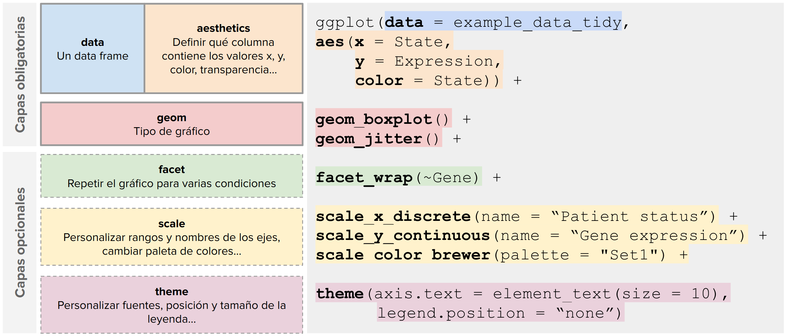
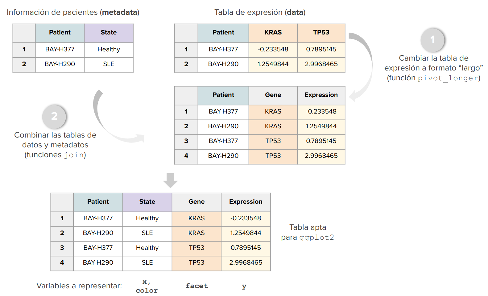

```{r setup, include=FALSE}
knitr::opts_chunk$set(echo = TRUE)
```

# Introducción

En este curso se van a abordar los principales usos de dos de las librerías de R más utilizadas para manipular y formatear datos (dplyr) y realizar figuras (ggplot2) mediante ejemplos sencillos, aumentando la dificultad y las funciones que aprenderéis a utilizar. A continuación se mostrarán algunas de las figuras complejas que sabrás realizar cuando termines este curso.

(Poner algunas figuras complejas: 1) volcano plot)

Para llevar a cabo este curso necesitarás utilizar las siguientes librerías:

```{r, message=FALSE, warning=FALSE, error=FALSE}
library(dplyr) ## Work with dataframes
library(ggplot2) ## Making figures
library(DT) ## Interface tables
library(pasilla) #Bioconductor
library(reshape2) ## Transform data
library(tidyr) ## pivot functions
library(tibble) ## modern dataframes
library(ggrepel) ## geom text without overlap
library(ggpubr) ## Publication-ready ggplot themes
```


# La sinergia `dplyr`-`ggplot2`

`ggplot2` nos permite crear una gran diversidad de gráficos con una capacidad de personalización muy alta. 

<p align="center">
{width=70%}
</p>


La creación de gráficos con `ggplot2` funciona por capas, siendo esenciales 3 de ellas:

<p align="center">
{width=90%}
</p>


- **data**: un data frame que contiene los datos a representar, con todas las variables necesarias.
- **aesthetics** o **aes**: en esta capa se determina qué columna del data frame contiene los valores `x` e `y` y aquellas variables que van a determinar aspectos como el color (`color`), relleno (`fill`) o la transparencia (`alpha`).
- **geom**: las capas `geom_` determinan el tipo de gráfico. Entre ellos, los tipos más frecuentes en bioinformática son:
  - Puntos (`geom_point()`, `geom_jitter()`)
  - Líneas (`geom_line()`)
  - Barras (`geom_bar()`)
  - Boxplots (`geom_boxplot()`)
  - Heatmaps (`geom_tile()`)
  

Opcionalmente, distinguimos 3 capas adicionales que ayudan a personalizar un gráfico:

- **facet**: sirve para repetir el mismo gráfico para varias condiciones (*por ejemplo, para obtener un boxplot de expresión de sanos vs. enfermos por cada gen del dataset*)
- **scale**: en estas capas se personalizan los ejes x e y (título, límites, número de marcas...) y también se determina la paleta de colores.
- **theme**: personalizar la apariencia general del gráfico (tamaño y tipo de fuente, posición de la leyenda...)

```{r, echo=FALSE}
example_metadata <- read.delim("https://bioinformaticsgrx.es/wp-content/uploads/2020/02/Phenodata.txt") 
example_data <- read.csv("example_data/example_data.csv")
example_data_tidy <- read.csv("example_data/example_data_tidy.csv")

# subset_expr <- example_metadata %>%
#   select(Patient, State) %>% 
#   distinct() %>% 
#   group_by(State) %>%
#   slice_sample(n=25) %>%
#   pull(Patient)

# example_data <- data.frame(Patient = subset_expr,
#                            KRAS = runif(length(subset_expr)),
#                            MLANA = runif(length(subset_expr)),
#                            TP53 = runif(length(subset_expr)),
#                            DMD = runif(length(subset_expr)))

# write.csv(example_data, "example_data/example_data.csv", row.names = FALSE)

# example_data_tidy <- example_metadata %>%
#   select(c(Patient, State)) %>%
#   distinct() %>%
#   right_join(example_data %>%
#                pivot_longer(-Patient, names_to = "Gene", values_to = "Expression"))
# 
# write.csv(example_data_tidy, "example_data/example_data_tidy.csv", row.names = FALSE)
```


Vamos a ver un ejemplo de gráfico sencillo donde se usan todas estas capas. En este gráfico, cada punto representa la expresión de un gen en un paciente:

```{r, fig.width=4, fig.height=5, fig.align='center'}
example_data_tidy %>% # Data
  ggplot(aes(x = State, # Column containing x variable
             y = Expression, # Column containing y variable
             color = State)) + # Column color variable
  
  geom_boxplot() + # Plot boxplot
  geom_jitter(width = 0.1, alpha = 0.5, size = 1) + # Plot dots over the boxplot
  
  facet_wrap(~Gene) + # One plot per gene
  
  scale_x_discrete(name = "Patient status") + # Change x axis title
  scale_y_continuous(name = "Gene expression") + # Change y axis title
  scale_color_brewer(palette = "Set1") + # Change color palette
  
  theme_pubr() + # Publication-ready theme
  theme(axis.text = element_text(size = 10), # Change axis titles font size
        legend.position = "none") # Hide color legend
```

Estamos representando 3 variables:

- **Estado del paciente** (sano o enfermo): representado en el eje x y en el color.
- **Expresión génica**: representado en el eje y.
- **Gen**: se genera un panel por cada gen.

Por ello, necesitamos un data frame con la siguiente estructura, donde las tres variables mencionadas anteriormente tienen una columna propia y cada fila es una observación:

```{r}
example_data_tidy %>% datatable()
```

Sin embargo, los datos de partida suelen tener una estructura más parecida a esta, donde los datos de expresión y la información de los pacientes vienen en tablas separadas (metadatos y datos):

- **Metadatos**: tabla que contiene información de los pacientes. En este caso, nos interesa la columna `State`.

```{r}
example_metadata %>% datatable()
```

- **Datos**: tabla que contiene los datos de expresión génica, donde cada fila es un paciente y cada columna un gen.

```{r}
example_data %>% datatable()
```


Aquí entra en juego el preprocesamiento de datos con `dplyr` para transformar y combinar estas tablas:


<p align="center">
{width=100%}
</p>

En este tutorial vamos a ver distintas funciones para transformar tablas de datos con `dplyr` y cómo podemos ponerlas en un formato adecuado para `ggplot2`, así como generar gráficos de alta calidad con este paquete.

# Paquete `dplyr`

En la mayoría de los casos, los datos que vamos a utilizar no suelen estar en el formato que nos interesa para utilizar ggplot2. Por ello se requieren de otras librerías que nos faciliten este trabajo de transformación de datos. La librería más potente para esto es `dplyr`.

## Funciones básicas de `dplyr`

*(TO-DO: Explicar los pipes)*

Esta librería tiene múltiples funcionalidades. Para hacer un análisis exploratorio de alguna de las más importantes, se usará una tabla con información clínica de muestras de sangre de lupus y donantes sanos.

```{r}
# Leemos el fichero
datos_clinicos = read.delim("https://bioinformaticsgrx.es/wp-content/uploads/2020/02/Phenodata.txt")

# Hacemos algún cambio rápido
datos_clinicos[datos_clinicos$Neutrophil_percent == 0,"Neutrophil_percent"] <- NA
datos_clinicos[datos_clinicos$Lymphocyte_percent == 0,"Lymphocyte_percent"] <- NA
datatable(datos_clinicos)
```

### `select` -> Filtrar columnas

*(TO-DO: Cambiar nombres de columnas con `select`)*

```{r}
## select: 
# La fórmula %>% se utiliza para introducir el dataframe
datatable(datos_clinicos %>% select(Patient,State,Gender)) 

# También podemos poner la primera y última columna que queremos mantener
# usando la fórmula from:to
datatable(datos_clinicos %>% select(Patient:Race)) 

 # Y podemos combinar ambas técnicas
datatable(datos_clinicos %>% select(Patient:Gender,Treatment))

# También podemos eliminar columnas
datatable(datos_clinicos %>% select(-State))
```

### `filter` -> Filtrar filas en base a condiciones

```{r}
# Indicamos la condición que queremos
datatable(datos_clinicos %>% filter(State == "Healthy")) 

# Pudiendo añadir varias
datatable(datos_clinicos %>% filter(State == "Healthy" & Gender == "F")) 

# O complicando el filtrado como queramos
datatable(datos_clinicos %>% filter((State == "SLE" & Gender == "F") & (Neutrophil_percent > 50 | Lymphocyte_percent > 30))) 

# Igualmente podemos añadir otras funciones con %>%
datatable(datos_clinicos %>% filter((State == "SLE" & Gender == "F") & (Neutrophil_percent > 50 | Lymphocyte_percent > 30)) %>% select(Patient)) 
```

### `mutate` -> Crear una nueva columna

```{r}
# Podemos generar una nueva columna llamada NLR que sea resultado de dividir
# las variables Neutrophil_percent y Lymphocyte_percent
datatable(datos_clinicos %>% mutate(NLR = Neutrophil_percent / Lymphocyte_percent))

# Como para algunas muestras no tendremos datos de NLR, podemos fitrar las mismas
# como se ha explicado previamente
datatable(datos_clinicos %>% mutate(NLR = Neutrophil_percent / Lymphocyte_percent) %>% filter(!(is.na(NLR))))

# Una función especial es add_rownames, que permite convertir los nombres de las filas en una columna más
datatable(datos_clinicos %>% add_rownames("Samples"))
```

### `pull` -> Crear un vector desde un dataframe

```{r}
# Solo indicar la columna que se quiere convertir en vector
datos_clinicos %>% pull(Patient)
```

### `group_by` -> Agrupar en base a una condición


```{r}
# Esta función por si sola no produce ningún cambio, sino que se utiliza para
# indicar a funciones posteriores que todo lo que se haga se hará
# separarando los diferentes grupos de la variable que se indique
datatable(datos_clinicos %>% group_by(Gender))
```

### `summarize` -> Estadísiticas de los datos

```{r}
#Queremos saber la media de SLEDAI de las muestras
datos_clinicos %>% summarize(Mean_SLEDAI = mean(SLEDAI,na.rm = T))

# Como se ha indicado previamente, podemos agrupar los datos usando la función group_by
datos_clinicos %>% group_by(Gender) %>% summarize(Mean_SLEDAI = mean(SLEDAI,na.rm = T))
datos_clinicos %>% group_by(State) %>% summarize(Max_SLEDAI = max(SLEDAI,na.rm = T))
datos_clinicos %>% group_by(Race) %>% summarize(SD_SLEDAI = sd(SLEDAI,na.rm = T))
```

### `arrange` -> Ordenar una columna

```{r}
# De menor a mayor
datatable(datos_clinicos %>% arrange(SLEDAI))

# De mayor a menor
datatable(datos_clinicos %>% arrange(desc(SLEDAI)))

# O estableciendo el orden manualmente
datatable(datos_clinicos %>% arrange(factor(Gender, levels = c("M","F"))))
```

### `count` -> Contar el número de filas de cada factor de una columna

```{r}
# Podemos ver cuantas filas hay de cada State
datos_clinicos %>% count(State)

# Y agrupar por Gender
datos_clinicos %>% group_by(Gender) %>% count(State)
```

### Pipes Complejos

A continuación harmeos un pipe más complejo de los vistos hasta ahora, para ver el potencial que podemos sacarle a `dplyr`.

```{r}
datos_clinicos %>% 
  # Creamos la columna NLR
  mutate(NLR = Neutrophil_percent / Lymphocyte_percent) %>% 
  # Filtramos para quedarnos solo con lupus y sin NA en NLR
  filter(!(is.na(NLR)) & State == "SLE") %>% 
  # Agrupamos por paciente. Cada paciente tiene una o varias visitas
  group_by(Patient) %>% 
  # Quedándonos con los pacientes con más de 3 visitas
  filter(n() > 3) %>% 
  # Y vemos cuantas visitas de cada paciente están por debajo o por encima de los valores normales de NLR
  count(NLR < 0.78 | NLR > 3.53) 
```

## Pivotar tablas (TO-DO)

## Combinar tablas

`dplyr` también nos da la posibilidad de combinar varias tablas de forma similar a como se hacen consultas en bases de datos. Para mostrar estas funciones seguiremos usando la base de datos clínicos de pacientes de lupus. La otra tabla que vamos a usar es una tabla de expresión de genes ficticia, con el fin de que no sea muy costoso computacionalmente

```{r}
# Añadir los rownames como columna llamada Samples
datos_clinicos <- datos_clinicos %>% add_rownames("Samples")

#Quedarnos con las 6 primeras muestras de lupus con NLR válido
muestras_lupus = datos_clinicos %>% 
  mutate(NLR = Neutrophil_percent / Lymphocyte_percent) %>%
  filter(!(is.na(NLR)) & State == "SLE") %>% 
  select(Samples) %>%
  head() %>%
  pull()

#Quedarnos con las 6 primeras muestras de sanos
muestras_sano = datos_clinicos %>% 
  filter(State == "Healthy") %>% 
  select(Samples) %>%
  head() %>%
  pull()


# Crear la tabla
gene_expression = data.frame(Genes = rep(paste0("Gene",seq(1,10)), c(rep(12,10))),
                             Samples = rep(c(muestras_lupus,muestras_sano),10),
                             Values = rnorm(120))

datatable(gene_expression)
```

Las funciones principales para combinar dataframes son: inner_join, left_join / right_join, full_join


```{r}
## Inner join: MATCH IN BOTH TABLES
datatable(gene_expression %>% inner_join(datos_clinicos,by="Samples"))
## Left join: prioritizes left table
datatable(gene_expression %>% left_join(datos_clinicos,by="Samples"))
datatable(datos_clinicos %>% left_join(gene_expression,by="Samples"))

datatable(gene_expression %>% right_join(datos_clinicos,by="Samples"))
datatable(datos_clinicos %>% right_join(gene_expression,by="Samples"))

datatable(gene_expression %>% full_join(datos_clinicos,by="Samples"))
```


*(TO-DO: Join por columnas con distinto nombre)*

## Caso práctico

A continuación vamos a preparar la tabla que vamos a usar para generar los gráficos en ggplot2. Para ello seguiremos usando los datos clínicos y las 12 muestras elegidas previamente, pero en este caso vamos a utilizar los datos reales de expresión de genes. Para evitar que nos lleve mucho tiempo, hemos preparado una matriz de expresión de 1000 genes

```{r}
# Descargar la matriz de expresión
exp_data = read.delim("https://bioinformaticsgrx.es/wp-content/uploads/2022/03/expr.txt")
dim(exp_data)

# Para pasar la matriz a un formato que nos sirva para ggplot2 usamos la librería reshape2
# y dplyr
gene_expression = as.data.frame(exp_data) %>% 
  rownames_to_column(var = "Genes") %>%  
  pivot_longer(cols = datos_clinicos$Samples,names_to = "Samples",values_to = "Values") %>%
  filter(Samples %in% c(muestras_lupus,muestras_sano)) %>%
  inner_join(datos_clinicos,by="Samples")
datatable(gene_expression)
```

# Paquete `ggplot2`


```{r, fig.align='center'}
# Generar un diagrama de cajas (boxplot)
ggplot(data = gene_expression,aes(x=Samples,y=Values))+ # Con la función ggplot indicamos el dataframe que queremos usar, así como las columnas que se quieren usar en los ejes x e y
  geom_boxplot() # La función geom_boxplot se usa para generar el diagrama de cajas
```

```{r, fig.align='center'}
# Si en vez de un diagrama de cajas quisiéramos generar un gráfico de tipo violín, solo cambiamos la función geom_boxplot por geom_violin
ggplot(data = gene_expression,aes(x=Samples,y=Values))+
  geom_violin()
```

Como es lógico, estas figuras no quedan bien. Por ejemplo, los nombres de las muestras se sobrelapan, el color del fondo puede no gustarnos etc. Para modificar los aspectos estéticos de las figuras usaremos la función `theme`.

## `theme` -> Modificar la apariencia

*(TO-DO: Hablar de `ggpubr`)*

En primer lugar vamos a comentar las diferentes temáticas que existen por defecto en ggplot2. Como se verá a continuación, cada temática cambia varios elementos del gráfico como el color de fondo o el color de los ejes

```{r}
ggplot(data = gene_expression,aes(x=Samples,y=Values))+
  geom_violin()+
  theme_classic()

ggplot(data = gene_expression,aes(x=Samples,y=Values))+
  geom_violin()+
  theme_bw()

ggplot(data = gene_expression,aes(x=Samples,y=Values))+
  geom_violin()+
  theme_dark()

ggplot(data = gene_expression,aes(x=Samples,y=Values))+
  geom_violin()+
  theme_light()

ggplot(data = gene_expression,aes(x=Samples,y=Values))+
  geom_violin()+
  theme_minimal()
```

Sin embargo en la mayoría de los casos querremos establecer nuestro propio diseño. Si miramos la ayuda de la función theme, veremos muchísimos parámetros que podemos modificar.

Por ejemplo, si queremos cambiar el tamaño del texto lo podemos hacer de así

```{r}
# Para modificar el texto debemos usar la función element_text
ggplot(data = gene_expression,aes(x=Samples,y=Values))+
  geom_violin()+
  theme(text = element_text(size = 20)) # Para cambiar todo el texto

# Si solo queremos cambiar el texto del título de los ejes usamos el parametro axis.title
ggplot(data = gene_expression,aes(x=Samples,y=Values))+
  geom_violin()+
  theme(axis.title = element_text(size = 20,color = "red")) # También podemos añadir color

# Y si lo que queremos es modificar los valores de los ejes, usamos la función axis.text
ggplot(data = gene_expression,aes(x=Samples,y=Values))+
  geom_violin()+
  # usamos axis.text.x para cambiar solo el eje x
  theme(axis.text.x =  element_text(size = 20,color = "red"))

# El propósito de ver todo esto era evitar que los nombres se mezclen.
# Una buena solución es ponerlas en vertical, modificando el ángulo
ggplot(data = gene_expression,aes(x=Samples,y=Values))+
  geom_violin()+
  #vjust para alinear el nombre en el centro
  theme(axis.text.x =  element_text(angle = 90,vjust = 0.5))
```

Igualmente podemos modificar los ejes del gráfico para cambiar el color o quitarlos

```{r}
# Para modificar ambos usamos la función axis.line con la función element_line
ggplot(data = gene_expression,aes(x=Samples,y=Values))+
  geom_violin()+
  theme(axis.text.x =  element_text(angle = 90,vjust = 0.5),
        axis.line = element_line(colour = "black"))

# Si queremos modificar alguno específicamente, lo indicamos
ggplot(data = gene_expression,aes(x=Samples,y=Values))+
  geom_violin()+
  theme(axis.text.x =  element_text(angle = 90,vjust = 0.5),
        axis.line.x = element_line(colour = "blue"))
```

Y finalmente podemos cambiar el fondo de la gráfica

```{r}
# Para modificar el fondo, usamos el parámetro panel.background con la función element_rect
ggplot(data = gene_expression,aes(x=Samples,y=Values))+
  geom_violin()+
  theme(axis.text.x =  element_text(angle = 90,vjust = 0.5),
        axis.line = element_line(colour = "black"),
        panel.background = element_rect(fill = "blue"))

# Si queremos controlar las rejillar usamos los parámetros panel.grid.major y panel.grid.minor
# con la función element_line
ggplot(data = gene_expression,aes(x=Samples,y=Values))+
  geom_violin()+
  theme(axis.text.x =  element_text(angle = 90,vjust = 0.5),
        axis.line = element_line(colour = "black"),
        panel.background = element_rect(fill = "white"),
        panel.grid.major = element_line(colour = "purple"),
        panel.grid.minor = element_line(colour = "orange"))

# Si no queremos que ningo de estos elementos aparezca
# usamos la función element_blank

ggplot(data = gene_expression,aes(x=Samples,y=Values))+
  geom_violin()+
  theme(axis.text.x =  element_text(angle = 90,vjust = 0.5),
        axis.line = element_line(colour = "black"),
        panel.background = element_blank(),
        panel.grid.major = element_blank(),
        panel.grid.minor = element_blank())
```

Por supuesto, con la cantidad de parámetros que se incluyen en la función `theme` hay muchas más cosas que se pueden modificar. Algunos de ellos los veremos en las siguientes secciones, principalmente aquellas relacionadas con la leyenda.


# Session info

```{r}
sessionInfo()
```


